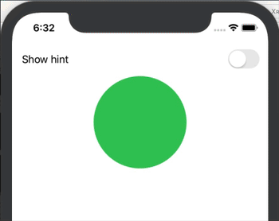

# Simple SwiftUI @State Demo
## Using @State and binding to create a UI that responds to user input to modify internal state
**(Updated for Xcode 11 Beta 5)**

This demo shows how simple it is to use SwiftUI’s **@State** and binding to create a UI that responds to user input to modify internal state.



All the required code is contained in **ContentView.swift**.

Whenever any of the properties marked with **@State** change the **View** is re-rendered. 
Normally, you would obviously not be able to mutate the state of a struct’s properties, because a struct is **immutable**. 
However, any property which is "wrapped" using the **@State** property wrapper _can_ be modified. This is because the property is not actually 
stored in the struct. SwiftUI manages storage of the property and will ensure that any change to it will result in the **View** being invalidated and its 
**body** property re-calculated (which updates the UI).

Property wrappers are a feature introduced in Swift 5.1. They enable property values to be **automatically** wrapped using specific types. 
So, for example, the following two lines are directly equivalent:

``` swift
@State private var showHint = false  // The @State property wrapper for showHint...
private var showHint = State<Bool>(initialValue: false)  // ...is directly equivalent to this
```
You can see that we create a **two-way** binding between the **Toggle** and the **showHint** state variable. 
When one changes the other is automatically changed too. Use the **$** prefix operator to specify a binding.

___

``` swift
//
//  ContentView.swift
//  SwiftUI-StateDemo
//
//  Created by Russell Archer on 03/08/2019.
//  Copyright © 2019 Russell Archer. All rights reserved.
//
// Updated for Xcode 11 Beta 5
//

import SwiftUI

struct ContentView: View {
    // When any of these @State variables change the View is re-rendered
    @State private var showHint = false
    @State private var bgColor = Color.green
    
    var body: some View {
        VStack {
            // Create a two-way binding between the Toggle and the showHint state variable.
            // When one changes the other is automatically changed too.
            // Use the $ prefix operator to specify a binding.
            Toggle(isOn: $showHint) {
                Text(showHint ? "Hide hint" : "Show hint")
            }
            
            if showHint {
                Text("See what happens if you tap the circle 👀")
                    .lineLimit(nil)
                    .multilineTextAlignment(.leading)
            }
            
            Circle()
                .fill(bgColor)
                .frame(width: 150, height: 150)
                .onTapGesture {
                    withAnimation {
                        self.bgColor = colorToggle.nextColor(currentColor: self.bgColor)  // Animates between colors 🤯
                    }
                }
            
            Spacer()
        }
        .padding()
    }
}

struct colorToggle {
    static func nextColor(currentColor: Color) -> Color {
        switch currentColor {
            case .green: return Color.red
            case .red: return Color.blue
            case .blue: return Color.green
            default: return Color.green
        }
    }
}

#if DEBUG
struct ContentView_Previews: PreviewProvider {
    static var previews: some View {
        ContentView()
    }
}
#endif

```
